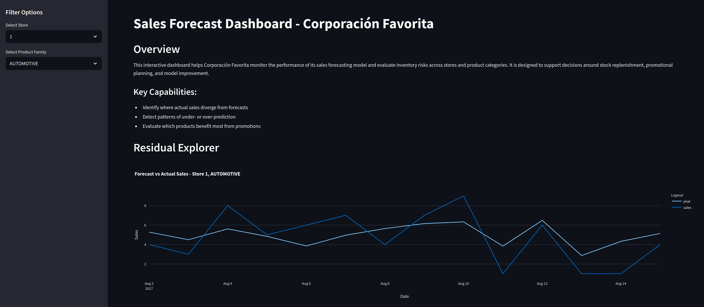

# Store Sales Forecasting & Inventory Optimization – Corporación Favorita

This project utilizes data analytics and machine learning techniques to provide actionable business insights for Corporación Favorita, focusing on preventing overstocking and understocking at individual store levels. The objective is to optimize inventory management, enhance customer satisfaction, and improve operational efficiency by aligning stock levels closely with actual consumer demand.

## Overview (Business Understanding)

Effective inventory management is crucial for retail businesses like Corporación Favorita. Overstocking leads to increased storage costs, potential wastage, and financial strain, while understocking results in missed sales opportunities and decreased customer satisfaction. This project addresses these issues by analyzing historical sales data, promotional activities, store transactions, seasonal trends, and external factors such as economic indicators and oil prices, given Ecuador's economy is significantly dependent on oil, potentially influencing consumer behavior and sales trends.

The primary goal of the project is to provide store managers, inventory planners, and senior management with actionable insights that guide inventory decisions. These insights are delivered through intuitive visualizations, predictive analytics, and a user-friendly Streamlit dashboard.

---

### Stakeholders

Key stakeholders benefiting from the project include:

* **Store Managers:** Use insights to optimize stock ordering, manage shelf space effectively, and avoid stockouts.
* **Inventory Planners:** Enhance supply chain planning and reduce logistical costs through improved inventory accuracy.
* **Sales and Marketing Teams:** Align promotional strategies with stock availability and demand forecasting.
* **Executive Management:** Utilize insights for strategic decision-making regarding budget allocation, inventory investments, and operational enhancements.

---

### Business Requirements

The project addresses the following specific business requirements:

* Generate accurate and actionable insights on optimal inventory levels for each store.
* Identify and forecast risks associated with potential overstocking or understocking scenarios.
* Provide visual tools that clearly illustrate historical trends, current stock levels, and predicted inventory needs.
* Deliver an intuitive and interactive dashboard accessible to non-technical users.

Key performance indicators (KPIs) for evaluating success include:

* Reduction in inventory holding costs and waste.
* Increased customer satisfaction through improved product availability.
* Enhanced accuracy in inventory ordering processes.

---

### Mapping Business Requirements to Data Analytics

| Business Requirement       | Data Visualization                         | ML Tasks & Techniques                        |
| -------------------------- | ------------------------------------------ | -------------------------------------------- |
| Optimal Inventory Insights | Inventory trend charts, stock heatmaps     | Time Series Analysis, Clustering             |
| Risk Forecasting           | Risk indicators, alert systems, bar charts | Predictive Classification, Anomaly Detection |
| User-Friendly Exploration  | Interactive dashboards                     | Integrated Streamlit Application             |

---

### User Interface Design

The Streamlit dashboard features:

* Interactive visualizations highlighting current inventory status.
* Store-specific filtering capabilities.
* Visual alerts and risk indicators for inventory management.
* Predictive analytics visualizations to aid decision-making.

---

### Data Collection and Preparation

The source data for this project is from the publicly available Kaggle competition:  
**[Store Sales - Time Series Forecasting](https://www.kaggle.com/competitions/store-sales-time-series-forecasting)**.  

This dataset is used in accordance with Kaggle's terms of use and includes:
- Historical daily sales for multiple stores and product families
- Store metadata
- Promotion flags
- Holiday and event data specific to Ecuador


Datasets utilized include historical sales records, promotional schedules, transactional data, seasonal events, and economic indicators. Preparation steps include:

* Consolidating and merging datasets.
* Addressing missing values, outliers, and data inconsistencies.
* Encoding categorical features.
* Engineering features such as sales lags and rolling averages for robust analysis.

---

### Machine Learning Pipeline

The ML pipeline includes:

* **Clustering:** Grouping stores and products based on sales patterns and characteristics.
* **Classification Models:** Predicting inventory risks, categorizing potential overstocking and understocking.
* **Time-Series Forecasting:** Analyzing historical sales and trends to project optimal inventory levels.

These predictions and classifications are integrated and visualized clearly within the dashboard.

---

### Insights and Visualization

Visualizations provided include:

* Historical versus forecasted inventory levels.
* Inventory performance and risk by store and product.
* Seasonal and promotional impacts on sales.
* Alerts for inventory anomalies and decision risks.

---

## Live Deployment

This dashboard is deployed live at:
**[https://store-sales-forecast.onrender.com/](https://store-sales-forecast.onrender.com/)**

> Note: It may take up to 30 seconds to load due to Render's free-tier cold start.

---

## Getting Started

1. Clone the repository:
```bash
git clone https://github.com/yourusername/store-sales-forecast.git
cd store-sales-forecast
```

2. Install dependencies:
```bash
pip install -r requirements.txt
```

3. Run the Streamlit app:
```bash
streamlit run app.py
```

⚠️ Note: For deployment purposes, this app uses remote loading of sample CSVs hosted on GitHub. These small-format files preserve structure while ensuring fast startup on cloud platforms like Render. You can replace the URLs in `app.py` with full datasets for local or production-scale runs.

In `app.py`, the following datasets are loaded via `pd.read_csv()` from raw GitHub URLs:

- `forecast_results.csv`
- `train.csv`
- `stores.csv`
- `inventory_prepared.csv`

> For example:
> ```python
> forecast_df = pd.read_csv("https://raw.githubusercontent.com/yourusername/store-sales-forecast/main/forecasts/forecast_results_sample.csv")
> ```

---

## Dependencies

This project uses the following Python libraries:

- streamlit
- pandas
- matplotlib
- seaborn
- plotly
- scikit-learn

All dependencies are listed in `requirements.txt`.

---

## Dashboard Design

The dashboard is structured into the following interactive sections:

- **Residual Explorer**  
  Compares actual vs forecasted sales using line charts and plots residuals over time.  
  ➤ *Business Requirement:* Forecast quality assessment.

- **Promotion Effectiveness**  
  Visualizes the average sales lift during promotional periods using a bar chart.  
  ➤ *Business Requirement:* Align promotional strategies with stock movement.

- **Stockout Risk Map**  
  Displays a heatmap showing store/product combinations with high stockout frequency.  
  ➤ *Business Requirement:* Identify high-risk inventory gaps.

---

## Plot Interpretations

- **Forecast vs Actual Sales**: Tracks alignment between predicted and actual sales, used to detect model drift or external disruption.
- **Residual Trends**: Helps detect persistent over- or under-prediction patterns, informing model adjustments or safety stock rules.
- **Promotion Lift Chart**: Measures how different product families respond to promotions and guides marketing resource allocation.
- **Stockout Risk Heatmap**: Pinpoints combinations where sales were zero but forecasts predicted demand, signaling stockout conditions.

---

## Model Evaluation Summary

The final model was evaluated using Root Mean Squared Log Error (RMSLE). For example, on Store 1 - BEVERAGES, the RMSLE was 0.39 — indicating the forecast tracks reasonably well with actual demand. 

This level of accuracy was deemed acceptable for generating strategic and operational insights rather than precise inventory control.

---

## ML Pipeline Integration

The ML pipeline (based on Facebook Prophet) was developed and validated in `03_model_training.ipynb`. Forecast results were exported and integrated into the Streamlit app. The pipeline feeds into the dashboard’s logic for residual analysis, stockout risk calculations, and promotion responsiveness.

---

## Project Hypotheses

- **H1:** Promotions drive measurable sales lift for select product families.  
  ✅ Validated via average sales comparison during promotions.

- **H2:** Stockouts can be detected by zero actuals with positive forecasts.  
  ✅ Validated using stockout flag logic and visualized via heatmaps.

- **H3:** Some store/product combinations exhibit consistent understocking patterns.  
  ✅ Observed in residual trends and stockout metrics over time.

---

## Technologies Used

- **Python 3.10** – Core language for modeling, analysis, and dashboard development
- **Pandas / NumPy** – Data cleaning, transformation, and feature engineering
- **Matplotlib / Seaborn / Plotly** – Static and interactive visualizations
- **Facebook Prophet** – Forecasting library used for time-series prediction
- **Scikit-learn** – Evaluation tools and optional modeling support
- **Streamlit** – Framework for building the interactive dashboard

## Acknowledgments

- Dataset: [Store Sales - Time Series Forecasting](https://www.kaggle.com/competitions/store-sales-time-series-forecasting)
- Educational Provider: Code Institute – for curriculum support and guidance
- Forecasting Engine: Facebook Prophet – developed by Meta and used under its open-source license
- This project was developed as part of the Code Institute Diploma in Full Stack Software Development

## Dashboard Preview

Below is a preview of the Streamlit dashboard:



---

### Project Outcomes

On completion, stakeholders will achieve:

* Improved accuracy in inventory management.
* Reduced operational costs associated with inventory.
* Enhanced customer satisfaction from consistent product availability.

This educational project serves as a practical demonstration of leveraging data analytics and machine learning for real-world business solutions in retail inventory management.
